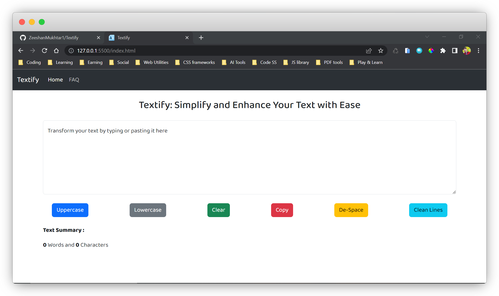
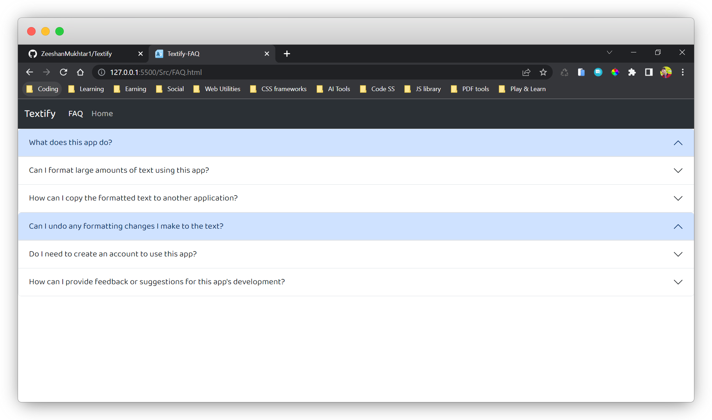

# Textify

The Textify App is a simple web application that provides various text manipulation functionalities such as converting text to uppercase or lowercase, counting characters and words, removing extra spaces, and line breaks. The app is built using HTML, CSS, and JavaScript, and utilizes the Bootstrap framework for styling.

## Features

- Convert text to uppercase or lowercase
- Count characters and words in the input text
- Remove extra spaces and line breaks
- Copy the input text to the clipboard
- Clear the input text

## Where Textify Can be Used

- Preparing Text for a Research Paper
- Cleaning Up a Large Dataset
- Formatting Text for Social Media
- Editing and Proofreading Documents

## Installation

To use the Textify App, simply open the index.html file in your web browser.

Alternatively, you can clone this repository using the following command:

```bash
 https://github.com/ZeeshanMukhtar1/Textify.git
```

## Contributing

If you have any feedback, suggestions, or bug reports, please feel free to open an issue or submit a pull request on this repository.

## Authors

- [Zeeshan Mukhtar](https://www.linkedin.com/in/zeeshanmukhtar1/)
- Textify is a web application developed by [Zeeshan Mukhtar](https://www.instagram.com/zeshanmukhtar01/), designed to provide a quick and efficient way to manipulate and analyze text data.

## Screenshots




### Live Demo

To see how Textify works, just click on [ this link](https://zeeshanmukhtar1.github.io/Textify/). It's a hands-on way to try out Textify and explore what it can do for you.
